## Setting up Knative on EKS ##
AWS EKS Docs: https://docs.aws.amazon.com/eks/latest/userguide/what-is-eks.html

1. IAM role configured for EKS to use. This is already created: `AWSServiceRoleForAmazonEKS`
2. SSH key created for communicating with EC2 worker nodes in the EKS cluster: `your-ec2-key-pair-name`
3. Have Kubernetes and Knative CLI installed (see local machine setup guide).
4. Install AWS Cli for your machine, as it is required for EKS Cli (eksctl) to work: https://docs.aws.amazon.com/cli/latest/userguide/getting-started-install.html
- Configure the AWS Cli with your IAM User credentials:
```
aws configure
```
It will prompt you for your 
- Access Key ID (for your IAM User)
- Access Secret (for your IAM User)
- default region (Ireland for us): eu-west-1
- output: json

6. Install EKS Cli (eksctl) for your machine: https://docs.aws.amazon.com/eks/latest/userguide/eksctl.html

**Docs for eksctl usage:** https://eksctl.io/usage/managing-nodegroups/

## Test Cluster Config ##

1. First confirm you're in the right Kubernetes context i.e AWS EKS by checking docker context.

2. Then, a Test cluster was created on EKS using eksctl with the cmd:
```
eksctl create cluster -f cluster-config.yaml
```

where cluster-config.yaml is:
```
apiVersion: eksctl.io/v1alpha5
kind: ClusterConfig
metadata:
  name: YOUR-EKS-Cluster-name
  region: your-region
managedNodeGroups:
  - name: your-nodegroup-name
    instanceType: m5.large
    desiredCapacity: 3
    ssh: # use EC2 key created for EKS
      publicKeyName: your-ec2-key-pair
```

3. Scale a cluster by providing the cluster config file

```
eksctl scale nodegroup --config-file=eks-test-cluster.yaml 
```

- or specify the config in cmd:

```
eksctl scale nodegroup --cluster=YOUR_CLUSTER_NAME --nodes=2 --name=YOUR_NODEGROUP_NAME
```

4. Manage Nodegroups

- Add a nodegroup to cluster via config file; existing nodegroups in config file will be excluded 
```
eksctl create nodegroup --config-file=dev-cluster.yaml
```
- Delete a nodegroup by specifying it
```
eksctl delete nodegroup --cluster=<clusterName> --name=<nodegroupName> --disable-eviction
```
- Delete a nodegroup through config file
```
eksctl delete nodegroup --config-file=dev-cluster.yaml --include=<nodegroupName> --approve
```
## Knative Setup ##
1. Install Knative and other dependencies to see everything runs ok.

- Knative serving: v1.1.1
- istio: v1.0.0

Installed directly from Knative installation docs with these versions substituted in URLs. Works with Gitlab private registries.

- You can uninstall Knative using these instructions (remember to specify your versions): https://knative.dev/docs/install/uninstall/

2. Setup DNS on Route53 using this guide: https://knative.dev/docs/serving/using-a-custom-domain/#verification-steps

- Get all configmaps: ```kubectl get configmap -n knative-serving```

- Edit domain configmap: ``` kubectl describe configmap config-domain -n knative-serving ```

## Adding HTTPS (AWS instructions) ##

### Resources ###

1. Knative Docs - Configure HTTPS: https://knative.dev/docs/serving/using-a-tls-cert/#using-certbot-to-manually-obtain-lets-encrypt-certificates
2. Istio Docs - Secure Gateways: https://istio.io/latest/docs/tasks/traffic-management/ingress/secure-ingress/
3. Istio Blog: https://rtfm.co.ua/en/istio-external-aws-application-loadbalancer-and-istio-ingress-gateway/
4. AWS ingress setup: https://kubernetes-sigs.github.io/aws-load-balancer-controller/v2.2/

### Steps to add HTTPS ###
1. Create a TLS Cert on ACM for your services domain.

Depending on your requirement you may create an ACM for a single root/nonroot domain. For example, if you own a root domain: 'domain.com' and you want several services running on it using this pattern:
- service1.domain.com
- service2.domain.com
- etc


You will need to create SSL certs for all these **subdomains** or create an SSL cert for a wildcard domain like this:
- \*.domain.com

Same is true for multiple level of subdomains, for example:
- service1.namespace.domain.com
- service2.namespace.domain.com


You will need to create a SSL cert for all the subdomains or a wild card one like:
- \*.namespace.domain.com
3. Load the TLS cert on Load balancer
4. OR: Add the following annotations to your istio-ingressgateway (LoadBalancer Service Type: which also creates the assocaited load balancer in Cloud) yaml to configure HTTPS and SSL. You can get that using:

```
kubectl edit svc istio-ingressgateway -n istio-system 
```

- And then add the annotations for HTTPS port mappings to use and SSL certificate ARN.

```
metadata:
  annotations:
    service.beta.kubernetes.io/aws-load-balancer-ssl-cert: "arn:aws:acm:xx-xxxx-1:1234567890:certificate/xxxxxx-xxx-dddd-xxxx-xxxxxxxx"
    service.beta.kubernetes.io/aws-load-balancer-backend-protocol: "http"
    service.beta.kubernetes.io/aws-load-balancer-ssl-ports: "https"
```

- you will also need to map the ports for HTTP and HTTPS in the file like this (which the "ssl-ports" references for "https"):

```
  ports:
  - name: status-port
    nodePort: 31302
    port: 15021 # Load balancer Port
    protocol: TCP
    targetPort: 15021
  - name: http
    nodePort: 30945
    port: 80 # Load balancer Port
    protocol: TCP
    targetPort: 8080
  - name: https
    nodePort: 30979
    port: 443 # Load balancer Port
    protocol: TCP
    targetPort: 8080
```
- **Port:** Is the Port on the service (Load Balancer type Service) where external traffic is reached.
- **TargetPort:** is the port on which your application in container will be listening on and where service will send requests to. Applicable only when used with ServiceEntries.

Your application in the container will need to be listening on this port also. You need to ensure that the target port (on the container) is a suitable value for "http" and "https" mappings. SSL terminates at the load balancer and traffic is forwarded to our instances (and thereby our container and Pods) using HTTP, so 8080, 8081 are suitable values.

- **NodePort:** It does not matter too much which nodePort (or EC2 Instance Port) you choose, as long as it is a sensible value between 30000 and 32767
- Note, that in `metadata.annotations` for last applied configurations, you do not need to change it, as it is simply the last applied configuration. It has no effect on port mappings.

### Ingress Gateways ###

1. **Knative Ingress Gateway** for inside the cluster. Edit the config Gateway from here:

```
kubectl edit gateway knative-ingress-gateway -n knative-serving 
```

2. **Istio Ingress Gateway** for routing traffic from outside to the cluster. Edit the service from here:

``` 
kubectl edit svc istio-ingressgateway -n istio-system 
```

### Issues in setting up HTTPS ###
Links to relevant issue:

1. https://stackoverflow.com/questions/58005126/configure-istio-ingress-using-aws-elb-for-https-traffic-with-a-custom-acm-certif
2. https://stackoverflow.com/questions/63618094/after-adding-aws-acm-eks-elb-is-not-opening-on-https/63763088#63763088
3. https://stackoverflow.com/questions/54829341/unable-to-access-pod-over-https-via-istio-gateway-running-as-elb-on-aws-eks-wi

## Fargate ##

Delve into using EKS on Fargate to save money; as using Fargate will only charge us for the times Pods are running. 

- knative installs fine, but knative serving pods don't run
``` 
Warning  FailedScheduling  18s (x17 over 14m)  default-scheduler  0/2 nodes are available: 2 node(s) had taint {eks.amazonaws.com/compute-type: fargate}, that the pod didn't tolerate.

``` 

- Istio installs fine, but istio-system pods don't run
``` 
Warning  FailedScheduling  3s (x6 over 112s)  default-scheduler  0/2 nodes are available: 2 node(s) had taint {eks.amazonaws.com/compute-type: fargate}, that the pod didn't tolerate.
``` 

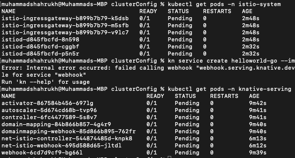

- Error Running Example App

``` 
Error: Internal error occurred: failed calling webhook "webhook.serving.knative.dev": Post "https://webhook.knative-serving.svc:443/?timeout=10s": no endpoints available for service "webhook"
Run 'kn --help' for usage
```

## API Gateway ##

Resources: https://docs.aws.amazon.com/apigateway/latest/developerguide/apigateway-regional-api-custom-domain-create.html

1. Add Api Gateway for unified API paths 

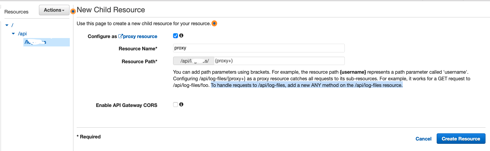
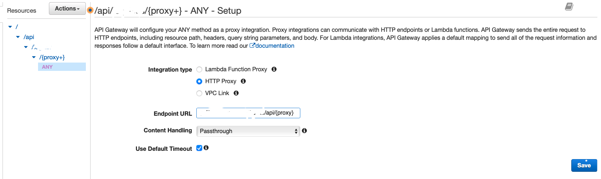

2. You can then deploy your API created in resources section to a specific stage. A stage is basically a way of versioning your API deployments i.e you can have dev,prod,test stages of your API, or v1,v2,v3 etc stages of your API.

2. Create a Custom Domain Name with the appropriate TLS certs for the domain. 

This will give you the API gateway domain name (regional endpoint).

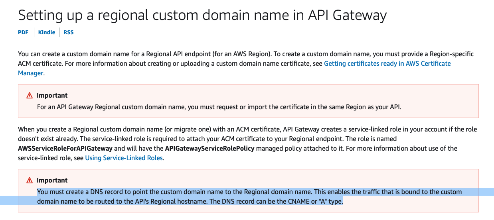

4. Create a DNS **A record** for the Custom Domain Name to API gateway regional domain name
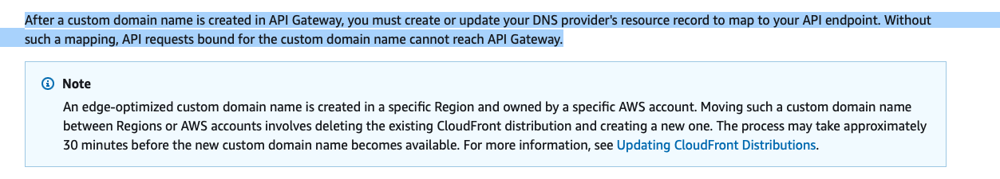

4. Add the mapping from the Custom Domain Name to the Api Stage, and specify the **Path** for the custom domain to use for the stage.
This way you can map the same custom domain name to multiple APIs and their stages 

- api.customdomain.com/v1 <--> 1st API, stage v1
- api.customdomain.com/v2 <--> 1st API, stage v2
- api.customdomain.com/second/v1 <--> 2nd API, stage v1

and so on

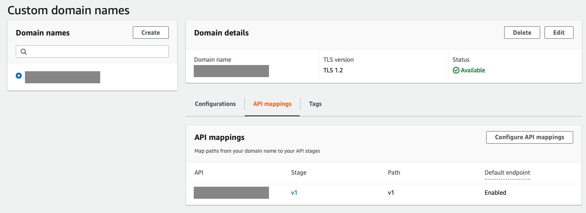
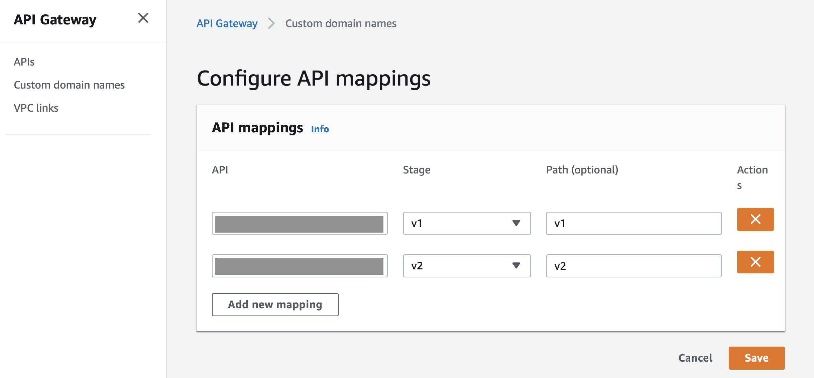
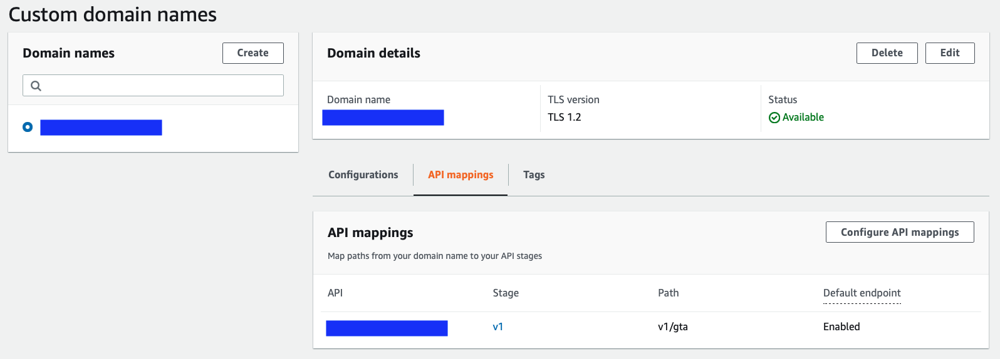

### Note: API Gateway has a payload limit of 10mb! ###

Docs: https://docs.aws.amazon.com/apigateway/latest/developerguide/limits.html


### AWS API Gateway: Auth ###

1. Add Authoriser to API Gateway using Cognito userpool 
Docs: https://docs.aws.amazon.com/apigateway/latest/developerguide/apigateway-enable-cognito-user-pool.html
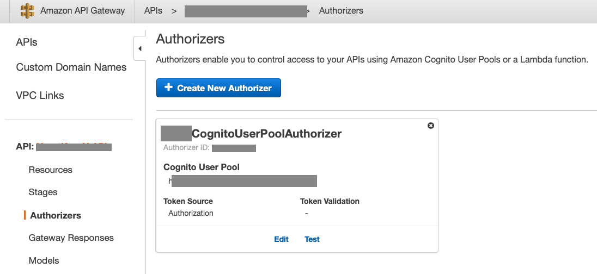

2. Create a resource server in Cognito User Pool for the backend, and define the scope if any
Docs: https://docs.aws.amazon.com/cognito/latest/developerguide/cognito-user-pools-define-resource-servers.html

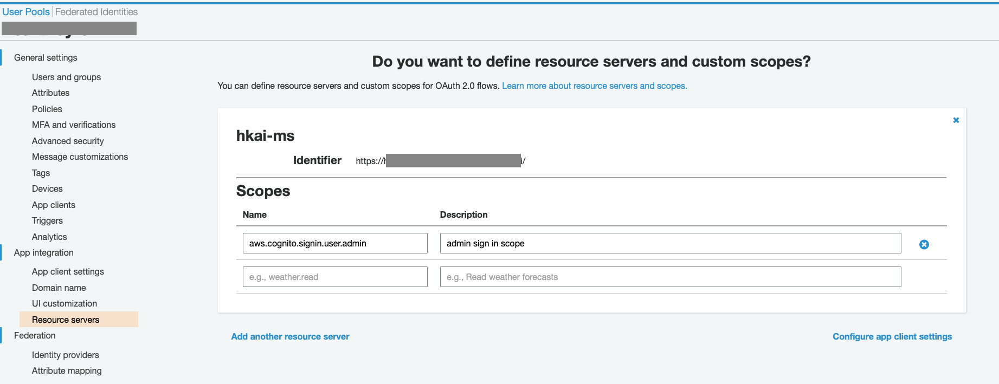

3. Use the created Authoriser in any backend API's method, and use the scope

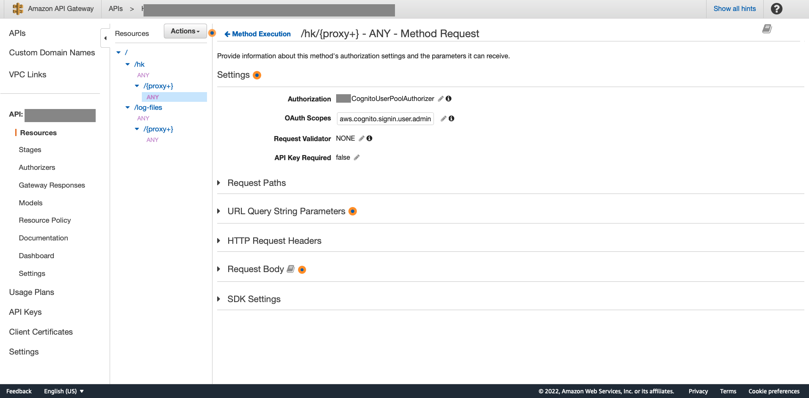

4. And implement Cognito authentication in backend code. e.g in Springboot applications enable Cognito User Pool Authentication and authorisation

Use the blog: https://www.baeldung.com/spring-security-oauth-resource-server

### Postman OAuth flow ###

You need to setup an app client with postman's Callback URL and can then use the auth server URL to initiate OAuth to get tokens to use in Postman.

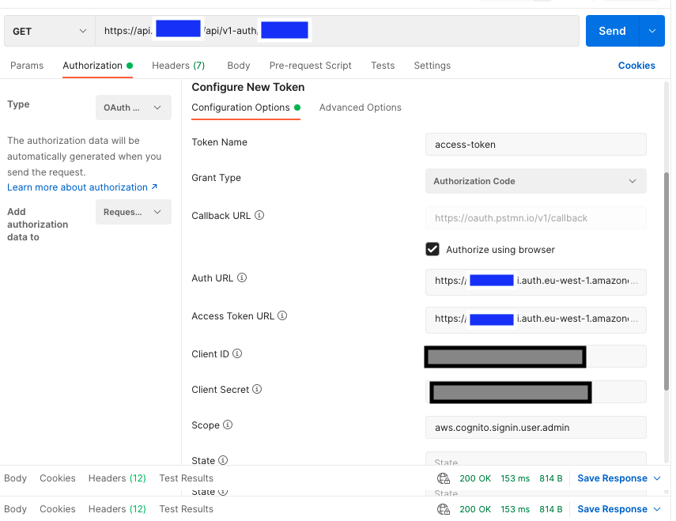

## Custom API Gateway ##

1. Build a custom api gateway using spring cloud API Gateway

### Custom API Gateway: Resource Server OAuth ###
Official Spring Docs: https://docs.spring.io/spring-security/reference/servlet/oauth2/resource-server/jwt.html

1. Add OAuth to Spring API Gateway using this blog (or similar):

- Resource Server: https://www.baeldung.com/spring-security-oauth-resource-server
- Resource Server OAUTH (All options): https://www.baeldung.com/spring-cloud-gateway-oauth2
- Okta Auth with Gateway: https://developer.okta.com/blog/2019/08/28/reactive-microservices-spring-cloud-gateway
- Resource Server Medium: https://blog.marcusjanke.de/spring-boot-2-3-oauth-2-jwt-security-using-amazon-cognito-d10e4e40ac05
- App Client with UI: https://www.baeldung.com/spring-security-oauth-cognito

## TroubleShooting ##

1. Sometimes it can take a few minutes for everyting to configure properly.

Especialy: If you have set up everything correctly: DNS, HTTPS, Gateway and Load balancers and SSL certs; 

## Next Steps ##


3. Add Mongo Db Deployment

4. Add K8 Dashboard with Auth; to easily see what's happening in Kubernetes environment.

5. Implement CI/CD; look into GitOps

6. Add EC2 User data; scripts to install required dependencies upon creation of cluster i.e Knative etc

